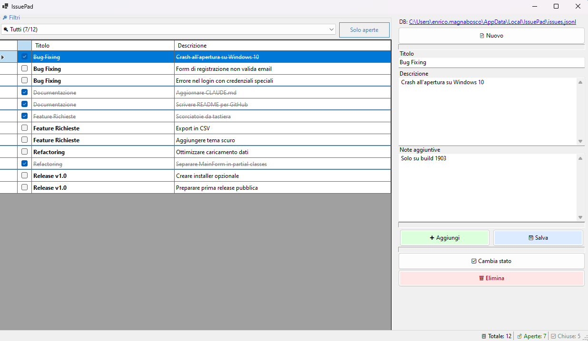

# IssuePad

Un'applicazione desktop leggera per la gestione di issue e task locali, senza bisogno di server o database esterni.


## Caratteristiche

- **100% Locale** - I dati restano sul tuo PC, nessun cloud o account richiesto
- **Portable** - Un singolo file EXE, nessuna installazione necessaria
- **Raggruppamento per Titolo** - Organizza le issue per progetto/categoria
- **Filtri Avanzati** - Filtra per titolo e stato (aperte/chiuse)
- **Contatori Real-time** - Visualizza quante issue sono aperte per ogni categoria
- **Persistenza Affidabile** - Database append-only che non perde mai dati

## Screenshot



## Installazione

### Opzione 1: Download EXE (Consigliata)
Scarica l'ultima release dalla pagina [Releases](../../releases) ed esegui `IssuePad.exe`.

### Opzione 2: Compila da sorgente
Richiede [.NET 9 SDK](https://dotnet.microsoft.com/download/dotnet/9.0)

```bash
git clone https://github.com/tuousername/IssuePad.git
cd IssuePad
dotnet run
```

Per creare l'EXE distribuibile:
```bash
dotnet publish -c Release -r win-x64 --self-contained -p:PublishSingleFile=true -o publish
```

## Utilizzo

1. **Crea un issue** - Compila titolo e descrizione, clicca "Aggiungi"
2. **Raggruppa** - Usa lo stesso titolo per issue correlate (es. "Bug Fixing", "Sprint 1")
3. **Filtra** - Usa il dropdown per vedere solo una categoria
4. **Completa** - Spunta la checkbox o clicca "Cambia stato"
5. **Modifica** - Seleziona un issue, modifica i campi, clicca "Salva"

## Dove sono i dati?

I dati vengono salvati in:
```
%LOCALAPPDATA%\IssuePad\issues.jsonl
```

Il formato JSONL (JSON Lines) è leggibile e facilmente esportabile. Ogni riga è un evento:
```json
{"type":"add","id":"20240115120000123","title":"Bug Fixing","description":"Fix login","whenUtc":"2024-01-15T12:00:00Z"}
{"type":"resolve","id":"20240115120000123","whenUtc":"2024-01-15T14:30:00Z"}
```

## Requisiti di Sistema

- Windows 10/11 (64-bit)
- Nessun altro requisito se usi l'EXE self-contained

## Tecnologie

- .NET 9
- Windows Forms
- System.Text.Json

## Licenza

MIT License - Vedi [LICENSE](LICENSE) per i dettagli.

---

*Creato per chi vuole gestire task senza complicazioni.*
